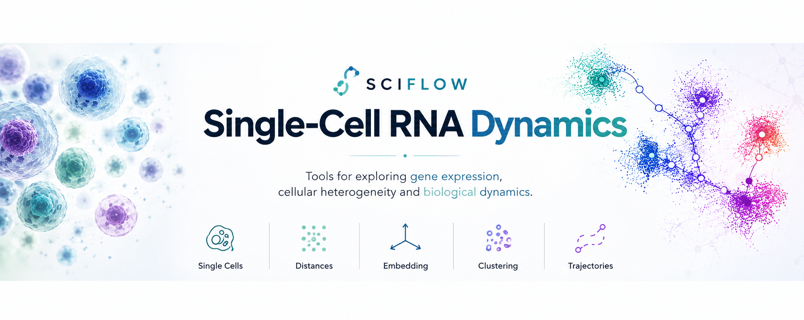
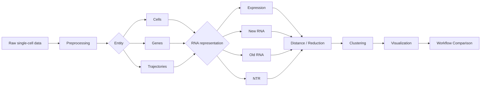
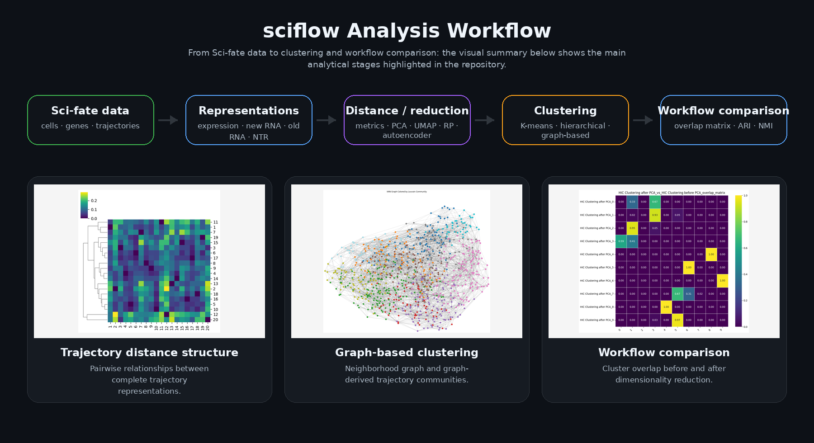
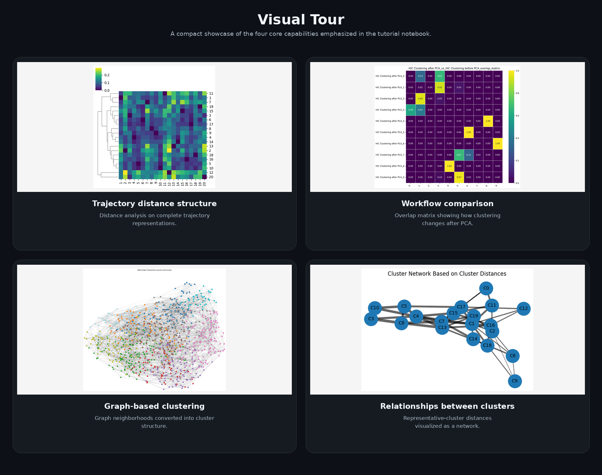
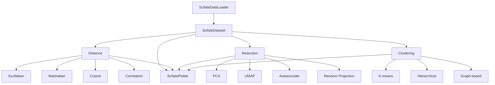

<p align="center">
  
</p>


<p align="center">
  <strong>Modular exploratory workflows for high-dimensional single-cell data</strong>
</p>

<p align="center">
  Distances · Clustering · Dimensionality Reduction · Trajectories · Workflow Comparison
</p>

<p align="center">
  
  
  
</p>

---

## Overview

`sciflow` is a Python framework for the exploratory analysis of **high-dimensional biological data**. It provides a modular interface for working with alternative data representations, distance measures, clustering algorithms, dimensionality-reduction techniques, and workflow-comparison strategies.

The repository uses the **Sci-fate dataset** as a complete case study. The notebook demonstrates how the same biological system can be examined from several perspectives — including cells, genes, trajectories, total RNA, newly synthesized RNA, old RNA, and new-to-total RNA ratios — and how analytical choices influence the structures that become visible.

The aim is not to prescribe a single fixed pipeline. Instead, `sciflow` is designed to support researchers in constructing and comparing analysis workflows that match their own research questions.

---

## Core Capabilities


| Analysis stage | Available methods |
|---|---|
| **Distance analysis** | Euclidean · Manhattan · Cosine · Correlation |
| **Clustering** | K-means · Hierarchical clustering · Graph-based clustering |
| **Dimensionality reduction** | PCA · UMAP · Autoencoder · Random Projection |
| **Workflow comparison** | Overlap matrix · Adjusted Rand Index · Normalized Mutual Information |
| **Visualization** | Heatmaps · Reduced-space plots · Cluster networks · Trajectory summaries |

---

## Motivation

High-dimensional single-cell datasets can be analyzed in many different ways. Choices such as the data representation, distance metric, dimensionality-reduction method, and clustering algorithm can substantially influence the structures detected in the data.

`sciflow` was developed to make these analytical choices explicit and easy to investigate. Instead of defining a single fixed analysis pipeline, the package provides modular components that can be combined according to the research question.

The Sci-fate analysis demonstrates this approach in practice. The same dataset is explored by varying the analytical entity, RNA representation, distance measure, dimensionality-reduction strategy, clustering method, and order of processing steps. The resulting workflows can then be compared directly to identify which structures remain stable and which depend on methodological choices.

---

## Analysis Workflow

The package is designed around interchangeable building blocks rather than one hard-coded pipeline.



This structure makes it possible to change one analytical choice at a time and inspect how the result changes.

---

## Installation

Clone the repository and install the package in editable mode:

```bash
git clone https://github.com/ZanderNic/sciflow.git
cd sciflow
pip install -e .
```

If needed, dependencies can also be installed explicitly:

```bash
pip install -r requirements.txt
```

---

## Quick Start

The following example shows the basic workflow: load the data, preprocess it, reduce dimensionality, cluster the cells, and visualize the resulting structure.

```python
from sciflow.data.scifate_dataset import ScifateDataLoader
from sciflow.cluster import HierarchicalClustering
from sciflow.reduction import PCA
from sciflow.plotting.scifate_plotter import ScifatePlotter

# Load data
loader = ScifateDataLoader()
data_raw = loader.load(folder_path="data/ScifateData")

# Preprocess expression data
data = data_raw.preprocess(
    data="expression",
    num_genes=6000,
    min_gene_variance=0.05,
)

# Cluster cells after PCA
clusters = data.create_clustering(
    reduction=PCA(n_components=20, calculated_components=100),
    clustering=HierarchicalClustering(
        k=10,
        method="average",
        metric="euclidean",
    ),
    entity="cell",
    data="expression",
    save=True,
)

# Visualize
plotter = ScifatePlotter(dataset=data)

pca_matrix = data.create_reduced_matrix(
    reduction=PCA(n_components=3, calculated_components=100),
    entity="cell",
    data="expression",
    save=True,
)

plotter.plot_reduced_matrix(
    pca_matrix,
    dimensions=(0, 1, 2),
    color_by=clusters["cluster"],
)
```

For the complete workflow, including trajectory analysis, distance computation, multiple clustering algorithms, UMAP, autoencoders, random projections, and workflow comparison, see [`01_tutorial.ipynb`](01_tutorial.ipynb).

---


<p align="center">
  
</p>

---

<p align="center">
  
</p>

---

## Package Architecture

The main interfaces used throughout the tutorial are organized around data, analysis, reduction, clustering, and plotting.



### Main classes

| Module | Main interfaces | Purpose |
|---|---|---|
| `sciflow.data` | `ScifateDataLoader`, `ScifateDataset` | Loading, preprocessing, metadata, and data access |
| `sciflow.distance` | `EuclideanDistance`, `ManhattanDistance`, `CosineDistance`, `CorrelationDistance` | Pairwise similarity and distance analysis |
| `sciflow.cluster` | `KMeans`, `HierarchicalClustering`, `GraphBasedClustering` | Grouping cells, genes, or trajectories |
| `sciflow.reduction` | `PCA`, `UMAP`, `Autoencoder`, `RandomProjektions` | Reduced representations and computational approximation |
| `sciflow.plotting` | `ScifatePlotter` | Heatmaps, embeddings, cluster summaries, networks, and comparisons |

---

<a id="tutorial"></a>
## Sci-fate Tutorial

The tutorial notebook is the central worked example of the repository. It uses Sci-fate to show how `sciflow` can be applied to high-dimensional single-cell data from loading and preprocessing through to workflow comparison.

Sci-fate is especially useful for this purpose because the analysis can combine conventional gene-expression measurements with information about newly synthesized RNA and trajectory-level structure.

<details>
<summary><strong>View notebook structure</strong></summary>

1. **Introduction**
2. **The Biology behind Sci-fate**
3. **Loading the Data**
4. **Preprocessing the Dataset**
5. **Working with the Dataset**
6. **Distance Analysis on Subsets of the Data**
7. **Distance Analysis on the Full Dataset**
8. **Clustering Methods**
9. **Dimensionality Reduction**
10. **Comparing Analysis Workflows**
11. **Conclusion**

</details>

The notebook is primarily exploratory. Its goal is to demonstrate how the package can be used to construct and compare workflows for real research questions rather than to optimize one predefined biological pipeline.

---

## What the Tutorial Investigates

| Perspective | Questions explored |
|---|---|
| **Representation** | How do total RNA, new RNA, old RNA, and NTR change the view of the same system? |
| **Entity** | What changes when cells, genes, or trajectories are treated as the observations? |
| **Distance** | How do distance metrics behave in high-dimensional single-cell data? |
| **Scalability** | When can random projection make large distance computations more practical? |
| **Clustering** | How do K-means, hierarchical, and graph-based clustering differ? |
| **Reduction** | What structures are preserved or changed by PCA, UMAP, autoencoders, and random projections? |
| **Workflow stability** | Does clustering change before vs. after PCA? |
| **RNA comparison** | Do total RNA and newly synthesized RNA produce similar cluster structures? |
| **Trajectory construction** | Does it matter whether PCA is applied before or after trajectory construction? |
| **Noise robustness** | Can PCA recover clustering structure after artificial perturbation? |


---

## Using `sciflow` for Other Research Questions

Although Sci-fate is the worked example in this repository, the package is designed around reusable analytical concepts rather than one specific dataset.

A typical research workflow can vary:

- the **entity** being compared,
- the **representation** used for each observation,
- the **distance metric**,
- the **dimensionality-reduction method**,
- the **clustering algorithm**,
- and the **order in which those steps are applied**.

This makes `sciflow` useful when the goal is not simply to run one standard pipeline, but to understand how analytical choices affect the structure inferred from high-dimensional biological data.

---


## Citation

If you use the data, trajectory reconstruction, or `sciflow` framework in academic work, please cite the relevant sources below.

### Sci-fate

Cao, J., Zhou, W., Steemers, F., Trapnell, C. & Shendure, J. **Sci-fate characterizes the dynamics of gene expression in single cells.** *Nature Biotechnology* **38**, 980–988 (2020). https://doi.org/10.1038/s41587-020-0480-9

<details>
<summary><strong>Copy BibTeX</strong></summary>

```bibtex
@article{cao2020scifate,
  title     = {Sci-fate characterizes the dynamics of gene expression in single cells},
  author    = {Cao, Junyue and Zhou, Wei and Steemers, Frank and Trapnell, Cole and Shendure, Jay},
  journal   = {Nature Biotechnology},
  volume    = {38},
  pages     = {980--988},
  year      = {2020},
  doi       = {10.1038/s41587-020-0480-9}
}
```
</details>

### Heterogeneity-seq / Trajectory Reconstruction

Berg, K., Sakellaridi, L., Rummel, T., Hennig, T., Whisnant, A. W., Lodha, M., Krammer, T., Prusty, B. K., Dölken, L., Saliba, A.-E. & Erhard, F.
Identifying Modulators of Cellular Responses by Heterogeneity-sequencing.
bioRxiv (2024).
https://doi.org/10.1101/2024.10.28.620481

<details> <summary><strong>Copy BibTeX</strong></summary>

```bibtex
@article{berg2024heterogeneity,
  title   = {Identifying Modulators of Cellular Responses by Heterogeneity-sequencing},
  author  = {Berg, K. and Sakellaridi, L. and Rummel, T. and Hennig, T. and Whisnant, A. W. and Lodha, M. and Krammer, T. and Prusty, B. K. and D{\"o}lken, L. and Saliba, A.-E. and Erhard, F.},
  journal = {bioRxiv},
  year    = {2024},
  doi     = {10.1101/2024.10.28.620481}
}
```
</details>

### sciflow

If `sciflow` or the analysis workflows implemented in this repository contributed to your work, please also cite or reference this repository:

```text
https://github.com/ZanderNic/sciflow
```

---

<p align="center">
  <sub>Built as a modular framework for exploring, comparing, and understanding high-dimensional single-cell analysis workflows.</sub>
</p>